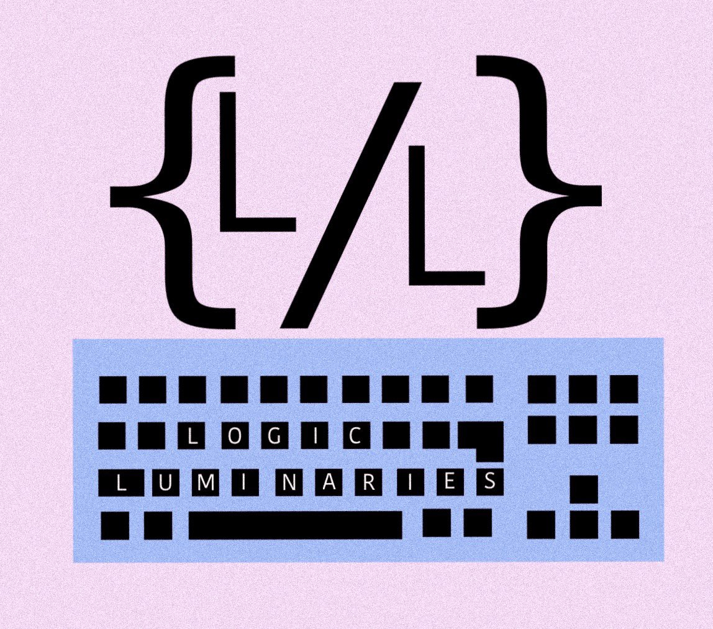
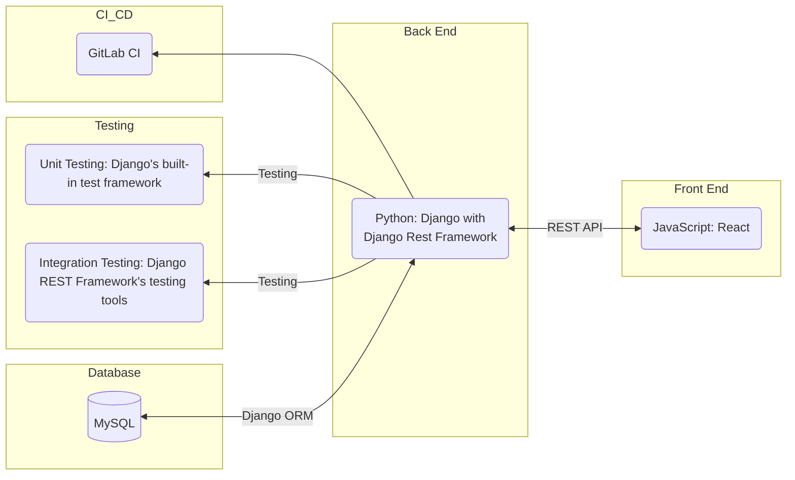
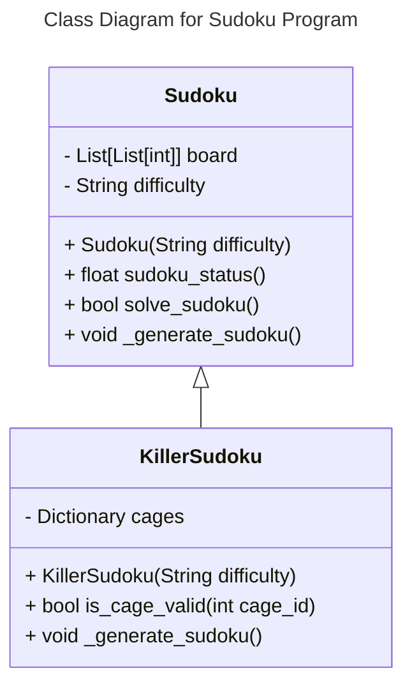
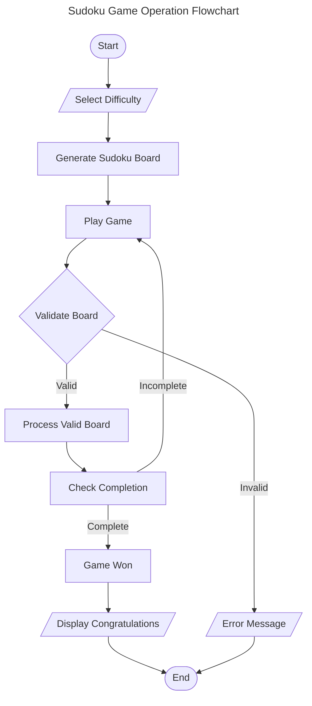
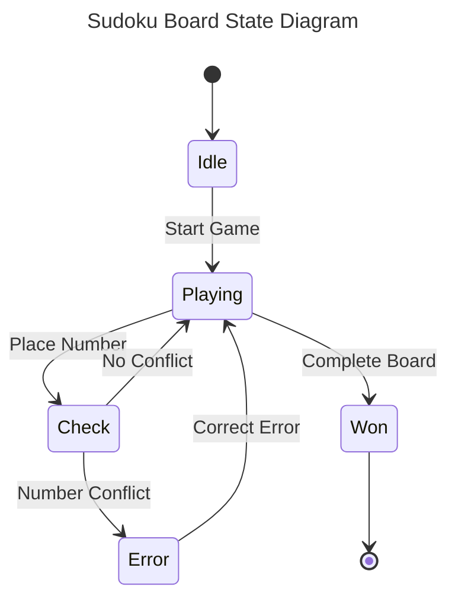
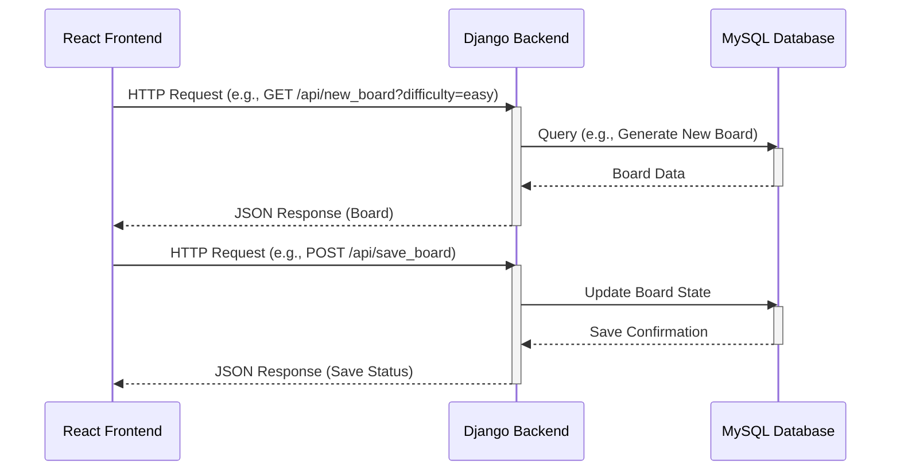

### Details
This repository is from a 6-person group project in Software Engineering, which I took in the spring of my junior year (2024). We developed a sudoku webapp, which created new puzzles, saved changes to them, checked them for completion, and allowed a user to restore saved in-progress puzzles. It was fully containerized in Docker and fully pipelined with coverage testing in GitLab. I mainly worked on designing and implementing the database schema for Tables and Players. This began by drawing a schema, then defining it in SQL, and finally implementing Django for the tables. I also helped debug integration issues with the features we developed. The project's container accesses a UW Computer Systems Lab domain that is no longer active, but this repository still includes the raw code itself, as well as a comprehensive display of our group's commitment to agile principles.

# Sudoku by Logic Luminaries

[](https://git.doit.wisc.edu/cdis/cs/courses/cs506/sp2024/team/mondaywednesdaylecture/T_10/logicluminaries/-/pipelines)
[](https://git.doit.wisc.edu/cdis/cs/courses/cs506/sp2024/team/mondaywednesdaylecture/T_10/logicluminaries/-/graphs/main/charts)
[](https://docs.python.org/3.12/)
[](https://docs.djangoproject.com/en/5.0/releases/5.0.2/)
[](https://react.dev/)
[](https://www.mysql.com/)
[](https://github.com/psf/black)
[](https://prettier.io/)



## Requirements and Specification Document

### Project Abstract

The Sudoku game software is a straightforward and engaging puzzle application suitable for _all skill levels_. It has an intuitive interface, with options to choose different difficulty levels. Key features include hints for assistance and a timer for tracking game duration. The game involves filling a 9x9 grid so that each column, row, and 3x3 subgrid contains all digits from 1 to 9. This project aims to provide a fun and challenging experience for users, enhancing their problem-solving skills and concentration.

<!-- This was the example paragraph that is being commented out.
This is an example paragraph written in markdown. You can use *italics*, **bold**, and other formatting options. You can also <u>use inline html</u> to format your text. The example sections included in this document are not necessarily all the sections you will want, and it is possible that you won't use all the one's provided. It is your responsibility to create a document that adequately conveys all the information about your project specifications and requirements.
-->
<!--Please view this file's source to see `<!--comments->` with guidance on how you might use the different sections of this document. -->

### Customer

<!--A brief description of the customer for this software, both in general (the population who might eventually use such a system) and specifically for this document (the customer(s) who informed this document). Every project will have a customer from the CS506 instructional staff. Requirements should not be derived simply from discussion among team members. Ideally your customer should not only talk to you about requirements but also be excited later in the semester to use the system.-->

The target customers for this Sudoku game software are puzzle enthusiasts of all ages and skill levels. It appeals to those who enjoy logical challenges and brain exercises, ranging from casual players seeking a fun pastime to serious puzzle solvers looking to test their skills. The game's user-friendly design make it accessible and engaging for a wide audience.

### User Requirements

<!--This section lists the behavior that the users see. This information needs to be presented in a logical, organized fashion. It is most helpful if this section is organized in outline form: a bullet list of major topics (e.g., one for each kind of user, or each major piece of system functionality) each with some number of subtopics.-->

<!-- Here is a user requirements sample from [Crookshanks](https://learning-oreilly-com.ezproxy.library.wisc.edu/library/view/practical-software-development/9781484206201/9781484206218_Ch02.xhtml):-->

| ID              | Description                                                                                                                                                                                                                                                                                                                                                                                                                                                                                                        |
| --------------- | ------------------------------------------------------------------------------------------------------------------------------------------------------------------------------------------------------------------------------------------------------------------------------------------------------------------------------------------------------------------------------------------------------------------------------------------------------------------------------------------------------------------ |
| [SRS-001](#117) | When user visits the homepage of the application, the frontend software SHALL display a homepage which is substantially similar to the figma wireframe of the homepage                                                                                                                                                                                                                                                                                                                                             |
| [SRS-002](#118) | When user visits the homepage of the application, the frontend software SHALL present the user with a series of options, represented as buttons with text contained Login and Register                                                                                                                                                                                                                                                                                                                             |
| [SRS-003](#119) | When the User clicks "Sign up" or "Register" the software shall go to the User Sign up Page or the Register Page.                                                                                                                                                                                                                                                                                                                                                                                                  |
| [SRS-004](#120) | When the user arrives at "Register" page there must be 3 text box inputs one for username, one for email and one for password. There also must be a button that shall get the user to the "Sign up" Page.                                                                                                                                                                                                                                                                                                          |
| [SRS-005](#121) | When the user arrives at "Login" page there must be 2 text box inputs one for email and one for password. There also must be a button that shall get the user to the "Sign up" Page and there must also be a "Submit" button.                                                                                                                                                                                                                                                                                      |
| [SRS-006](#122) | If user clicks the "Submit" button on the "Sign Up" Page there shall appear a green confirmation message.                                                                                                                                                                                                                                                                                                                                                                                                           |
| [SRS-007](#123) | If the user clicks the submit button on the Sign in page then the page shall correctly authenticate and go to the Games page.                                                                                                                                                                                                                                                                                                                                                                                      |
| [SRS-008](#124) | The Games page must have The text "Welcome, [user]" as well as the cards that have their own respective buttons that the user can choose between which game they would like to play.                                                                                                                                                                                                                                                                                                                               |
| [SRS-009](#125) | When the User has chosen a game, by clicking on the respective button. Both games Killer Sudoku and Normal Sudoku. The software shall take the user to Game Mode Selection Page where there are two buttons: New Game and Load Saved Game                                                                                                                                                                                                                                                                          |
| [SRS-010](#126) | If the user choose Load game the Software Shall go to the list of Saved Games.                                                                                                                                                                                                                                                                                                                                                                                                                                     |
| [SRS-011](#127) | If the User choose Create new Game, the software shall go to another page and ask if the game difficulty that they want is easy medium or hard in the form of buttons.                                                                                                                                                                                                                                                                                                                                             |
| [SRS-012](#128) | In both cases where the user clicked on a button, that generated a board. One case for if they chose difficult on a new board or if they chose a saved game. The software must show a 9x9 grid where the user can input numbers by clicking on a cell and then must be able to click on a number pop up in order to replace or put the number on the cell. The Board must be generated as a Sudoku board where all the Blue numbers are un editable and all the numbers that are inputted thereafter are editable. |
| [SRS-013](#129) | On the Sudoku board page there should be a submit button in relation to when all the numbers of the board are submitted.                                                                                                                                                                                                                                                                                                                                   |
| [SRS-014](#130) | On every page frontend page minus the home page. There must exist a Banner at the top that leads back to your logged in page.                                                                                                                                                                                                                                                                                                                                                                                      |

<!--<div align="center"><small><i>Excerpt from Crookshanks Table 2-2 showing example user requirements for a timekeeping system</i></small></div>-->

<!-- this is example that is being commented out
- You
  - Can
    - Use
- Bullet
  - Points
    - In
    - Markdown
-->

### Use Cases & User Stories

<!--Use cases and user stories that support the user requirements in the previous section. The use cases should be based off user stories. Every major scenario should be represented by a use case, and every use case should say something not already illustrated by the other use cases. Diagrams (such as sequence charts) are encouraged. Ask the customer what are the most important use cases to implement by the deadline. You can have a total ordering, or mark use cases with “must have,” “useful,” or “optional.” For each use case you may list one or more concrete acceptance tests (concrete scenarios that the customer will try to see if the use case is implemented).-->

<!-- Here is a sample user story from [Clean Agile](https://learning-oreilly-com.ezproxy.library.wisc.edu/library/view/clean-agile-back/9780135782002/ch03.xhtml#ch03lev1sec1) using a markdown block quote:

> As the driver of a car, in order to increase my velocity, I will press my foot harder on the accelerator pedal. -->

<!--
1. You
   1. Can
      1. Also
2. Use
   1. Numbered
      1. Lists
-->

See  for User Stories list.

- Issues 1-18 Setting up communitcation, choosing roles, choosing stack, setting up gitlab to our liking
- Issues 19-21 Installing software and getting set up with React, MySQL, and Django
- Issues 22-53 Defining backend models, frontend interface, integrating the two
- Issues 54-60 Making adjustments to previous definitions after completing walking skeleton, implementing styling
- Issues 61-69 Adding integrated functionality to walking skeleton, coverage testing for generation algorithm
- Issues 70-72 Completing frontend/backend/database data transfer, expanding coverage testing, adding win screen
- Issues 73-84 Adding continous deployment, static analysis, screens, improving algo, and saving initial state
- Issues 85-97 Handling blue/black, rework UI, fix, show progress, and handle duplicate emails
- Issues 98-107 Implement and add killer Sudoku variant, killer tests, 100% coverage, sphinx docs
- Issues 108-134 Refactor, update views, add badges, more coments, adding final diagrams and research

#### Main Epics

| ID     | Description                                                                                | Priority | Status   |
| ------ | ------------------------------------------------------------------------------------------ | -------- | -------- |
| EPIC#1 | Generate, Backend, 9x9 grid of puzzle and solution                                         | High     | Complete |
| EPIC#2 | Provide, Backend, variaing levels of difficulty                                            | High     | Complete |
| EPIC#3 | Store the values, Data Wrangler, of the the puzzle grid and solution in the MySQL Database | High     | Complete |
| EPIC#4 | Create an Interface, front end, where a user can solve the puzzle                          | Med      | Complete |
| EPIC#5 | (Stretch Goals) Support multiple variants of Sudoku, such as killer, etc.                  | Low      | Open     |
| EPIC#6 | (Stretch goal) Include tools for solving, such as pencil marking, coloring, and hinting.   | Low      | Open     |

### User Interface Requirements

<!--Describes any customer user interface requirements including graphical user interface requirements as well as data exchange format requirements. This also should include necessary reporting and other forms of human readable input and output. This should focus on how the feature or product and user interact to create the desired workflow. Describing your intended interface as “easy” or “intuitive” will get you nowhere unless it is accompanied by details.-->

Link to Figma prototype board: [Prototype](https://www.figma.com/file/sHQWq1l1Ohp6OeOpo6M7Uj/Sudoku-Prototype?type=design&node-id=0%3A1&mode=design&t=vHhiSbuQ8qf681xa-1)

Intentionally designed with accessibility and simplicity in mind (contrasting colors that are colorblind friendly, large and easy to read typeface). Lots of sudoku apps on the web are needlessly complicated, ours will not be. This site is a simple place to solve boards, no more, no less, and the design should reflect that.

<!--NOTE: Please include illustrations or screenshots of what your user interface would look like -- even if they’re rough -- and interleave it with your description.-->

<!-- Images can be included with `` -->

### Security Requirements

<!--Discuss what security requirements are necessary and why. Are there privacy or confidentiality issues? Is your system vulnerable to denial-of-service attacks?-->
As of now there is an issue where games pages are accessible to non-users, however they cannot load or save boards without an account to post to the database. So, those pages that are accessible are ultimately useless without logging in anyways.

### System Requirements, Installation, and Usage

<!--List here all of the external entities, other than users, on which your system will depend. For example, if your system inter-operates with sendmail, or if you will depend on Apache for the web server, or if you must target both Unix and Windows, list those requirements here. List also memory requirements, performance/speed requirements, data capacity requirements, if applicable.-->

You need at least 4 GB of RAM, a 64-bit kernel with CPU support for virtualization, and a Docker Desktop installed. Then run these commands:

``` sh
ssh -L localhost:8000:localhost:8000 -L localhost:3000:localhost:3000 <username>@cs506-team-10.cs.wisc.edu
cd /nobackup/
docker login registry.doit.wisc.edu -u <GAT> -p <GAT>
git config --global credential.helper store
git clone https://<GAT>@git.doit.wisc.edu/cdis/cs/courses/cs506/sp2024/team/mondaywednesdaylecture/T_10/logicluminaries.git
cd logicluminaries/
docker compose -p sudoku up
```

### Specification

<!--A detailed specification of the system. UML, or other diagrams, such as finite automata, or other appropriate specification formalisms, are encouraged over natural language.-->

<!--Include sections, for example, illustrating the database architecture (with, for example, an ERD).-->

<!--Included below are some sample diagrams, including some example tech stack diagrams.-->

#### Technology Stack

The following is the tech stack for our Sudoku project



#### Database

---

## ERD for SudokuDB


#### Class Diagram



#### Flowchart



#### Behavior



#### Sequence Diagram



### Standards & Conventions

See CodingStandardsDocument for a list of our design paradigms.

<!--Here you can document your coding standards and conventions. This includes decisions about naming, style guides, etc.-->

## Scrum Masters and Product Owners:

| Sprints | PO    | SM     |
| ------- | ----- | ------ |
| 0       | Grace | Carlos |
| 1       | Grace | Carlos |
| 2       | Isaac | Nima   |
| 3       | Bella | Claire |

## Roles:

| Roles                          | Major Role | Minor Role |
| ------------------------------ | ---------- | ---------- |
| Backend Engineer               | Claire     | Carlos     |
| Frontend Engineer              | Bella      | Grace      |
| Data Wrangler                  | Isaac      | Bella      |
| Algorithm Engineer             | Nima       | Isaac      |
| Integration Manager            | Grace      | Nima       |
| QA Tester / Jack of All Trades | Carlos     | Claire     |

- Every member should write code using test driven devolopment
- Every member should write their own documentation in how to do stuff (so that another person can follow the instructions)


## Project status

Healthy and progressing towards completion.

<!--If you have run out of energy or time for your project, put a note at the top of the README saying that development has slowed down or stopped completely. Someone may choose to fork your project or volunteer to step in as a maintainer or owner, allowing your project to keep going. You can also make an explicit request for maintainers.-->
