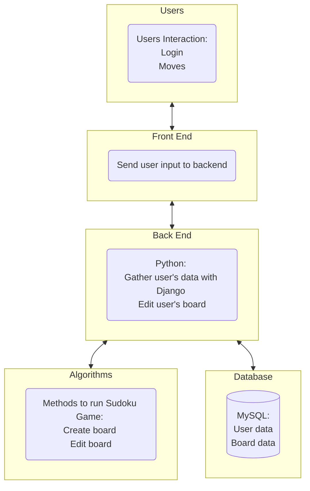

#### System Architecture

```mermaid
flowchart TD
subgraph one [Users]
    A(Users Interaction: \nLogin \nMoves)
end

subgraph two [Front End]
	B(Send user input to backend)
end

subgraph three [Back End]
	C(Python: \nGather user's data with Django \nEdit user's board)
end

subgraph four [Algorithms]
    D(Methods to run Sudoku Game: \nCreate board \nEdit board)
end

subgraph five [Database]
	E[(MySQL: \nUser data \nBoard data)]
end

one <--> two
two <--> three
three <--> four
three <--> five
```
